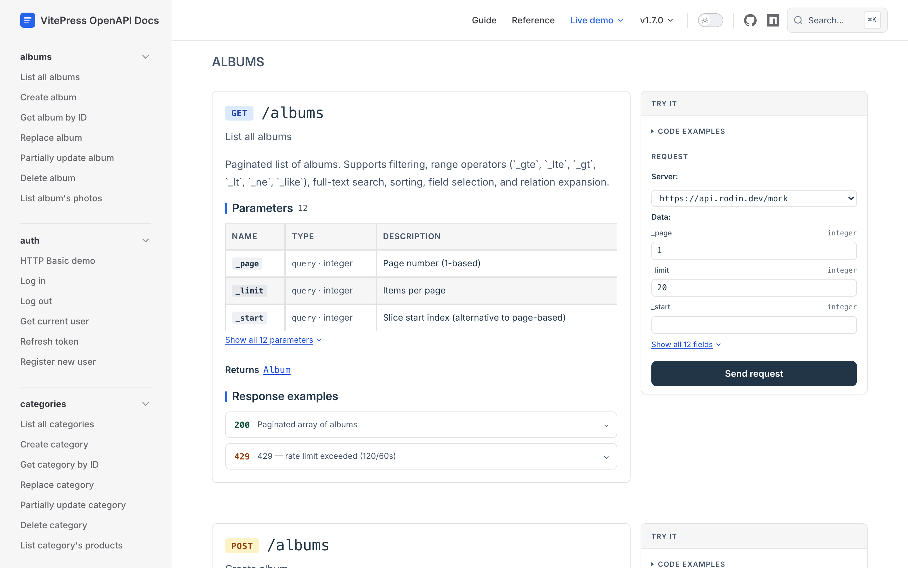

[](https://www.npmjs.com/package/vitepress-openapi-docs)
[](https://github.com/rodindev/vitepress-openapi-docs/actions/workflows/ci.yml)
[](./LICENSE)

# vitepress-openapi-docs

A Vue-native VitePress plugin that composes OpenAPI endpoints inline with your markdown prose and generates the rest of the site around them: per-operation and per-schema pages, a tag-grouped sidebar, a git-driven changelog, Cmd+K search, and multi-API support.

<picture>
  <source media="(prefers-color-scheme: dark)" srcset=".github/readme/endpoint-dark.png">
  
</picture>

This page is the [live demo](https://rodindev.github.io/vitepress-openapi-docs/api/mock/), backed by a real mock server.

## Why this exists

Swagger UI, Scalar, RapiDoc, Stoplight Elements all render API docs inside a web component or iframe. They work, but the output is a standalone widget: you can't put a paragraph between two endpoints, and you can't style it with your VitePress CSS variables.

This plugin renders endpoints as Vue components in light DOM, so they compose inline with your markdown prose:

```md
# Authentication

Exchange your API key for a session token:

<OpenApiEndpoint id="auth.login" />

Then use the token on subsequent calls:

<OpenApiEndpoint id="users.list" auth="bearer" />
```

On top of that you get a full docs site, not just a widget: auto-generated pages, Cmd+K search, schema cross-links, a git-driven changelog, and multi-API support with independent sidebars. SDK snippets refresh as you change the auth token, and auth persists across pages.

## Install

```bash
npm create vitepress-openapi-docs@latest my-api-docs
cd my-api-docs && npm install && npm run dev
```

Or add to an existing VitePress site:

```bash
npm i vitepress-openapi-docs vue-api-playground
```

Two files to wire up. See the [full guide](https://rodindev.github.io/vitepress-openapi-docs/guide/existing-site).

## What's included

- **`<OpenApiEndpoint>`**: one operation inline in any markdown page: params, request/response types, SDK snippets, try-it panel, auth
- **`<OpenApiSpec>`**: full spec grouped by tag
- **`<OpenApiSchema>`**: property table with clickable `$ref` links
- **`<OpenApiChangelog>`**: git-history-driven spec diff (added/removed/renamed operations per commit)
- **Cmd+K jumper**: fuzzy search across all operations and schemas
- **Multi-API**: N specs, one config, independent sidebar per spec, one jumper
- **Auth**: bearer / basic / apikey / OAuth2 passthrough, stored in sessionStorage
- **Syntax highlighting**: SDK snippets and response JSON share a VS Code Default palette via vue-api-playground tokens; no Prism or Shiki dependency
- **< 14 KB** client bundle (peer deps excluded), enforced in CI

## Requirements

- Node.js >= 20
- Vue >= 3.5
- VitePress >= 1.0
- vue-api-playground >= 2.5

## License

MIT
